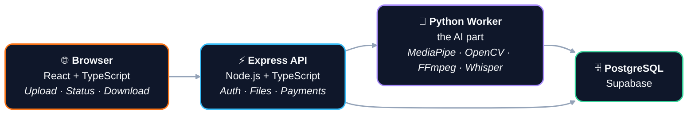

A few weeks ago, my childhood team, Palmeiras, won the Campeonato Paulista 2026. If you know me, you know this is basically a national holiday in my world.

I was watching the post-match interview with our coach Abel Ferreira. He said something like *"I do not need much to be happy, just need Palmeiras winning"* and I thought, that's it. I need to post this on Instagram. I need to send this to every friend who supports a rival team. This is the good stuff.

So I tried to screenshot the video on YouTube and share it on my stories.

You already know where this is going.

The video was 16:9, horizontal, wide, like YouTube videos are. Instagram stories are 9:16, vertical. So I had two options: a zoomed-out version with black bars on the sides making Abel look tiny, or a cropped version where I'd have to pick one fixed area and lose half the frame.

Neither felt right. Neither passed the vibe of watching it live.

And right there, that was the lightbulb moment.

*"I can track the person in the video automatically and re-crop it in real time. And if I can do it, other people probably need this too."*

That's how **AI Video Frame** was born.

---

## What is AI Video Frame?

<a href="https://aivideoframe.com" target="_blank" rel="noopener noreferrer">aivideoframe.com</a> is a web tool that takes any video and intelligently reframes it to a different aspect ratio, keeping the main subject centered the whole time using AI pose detection.

You upload a video. You pick a ratio, whether that's 9:16 for TikTok/Reels, 1:1 for a square post, 16:9 for YouTube, or a few others. The AI tracks the person in the video and crops it frame by frame, following their movements smoothly. You download the result.

It also has an optional **subtitle generator** powered by OpenAI Whisper, with automatic language detection and translation to 20+ languages, rendered as karaoke-style captions that highlight each word as it's spoken.

Beyond the web app, I also published it as an API on <a href="https://rapidapi.com/vitorvieirachagas/api/ai-video-frame-api/playground/apiendpoint_c339886f-6712-435a-a953-a71fe1fce052" target="_blank" rel="noopener noreferrer">RapidAPI</a> so developers can integrate it into their own tools.

Here's what that looks like in practice:

<div class="not-prose video-compare" style="margin: 2.5rem 0; position:relative;">
  <div style="display:flex; gap:0; justify-content:center; align-items:center; flex-wrap:wrap;">
    <div style="text-align:center; flex:1; min-width:200px;">
      <video src="/videos/ai-video-frame-demo1-original.mp4" autoplay muted loop playsinline
        style="width:100%; border-radius:0.75rem; border:1px solid #ebebeb;">
      </video>
      <p style="font-size:0.8rem; color:#9b9b9b; margin-top:0.5rem;">Original (16:9)</p>
    </div>
    <div style="display:flex; flex-direction:column; align-items:center; justify-content:center; padding:0 0.75rem; align-self:stretch;">
      <div style="flex:1; width:2px; background:linear-gradient(to bottom, transparent, #d1d5db, #d1d5db, transparent); border-radius:1px;"></div>
      <div style="background:#18181b; color:#fff; font-size:0.65rem; font-weight:700; letter-spacing:0.05em; padding:0.3rem 0.5rem; border-radius:9999px; border:2px solid #d1d5db; white-space:nowrap; margin:0.5rem 0;">VS</div>
      <div style="flex:1; width:2px; background:linear-gradient(to bottom, transparent, #d1d5db, #d1d5db, transparent); border-radius:1px;"></div>
    </div>
    <div style="text-align:center; flex:0 1 auto; min-width:140px; max-width:240px;">
      <video src="/videos/ai-video-frame-demo1-reframed.mp4" autoplay muted loop playsinline
        style="width:100%; border-radius:0.75rem; border:1px solid #ebebeb;">
      </video>
      <p style="font-size:0.8rem; color:#9b9b9b; margin-top:0.5rem;">Reframed (9:16)</p>
    </div>
  </div>
  <button class="video-sound-toggle" style="position:absolute; top:0.75rem; right:0.75rem; background:rgba(0,0,0,0.55); border:none; border-radius:50%; width:36px; height:36px; cursor:pointer; display:flex; align-items:center; justify-content:center; transition:background 0.2s;" aria-label="Toggle sound">
    <svg class="icon-muted" width="18" height="18" viewBox="0 0 24 24" fill="none" stroke="white" stroke-width="2" stroke-linecap="round" stroke-linejoin="round"><polygon points="11 5 6 9 2 9 2 15 6 15 11 19 11 5"/><line x1="23" y1="9" x2="17" y2="15"/><line x1="17" y1="9" x2="23" y2="15"/></svg>
    <svg class="icon-unmuted" width="18" height="18" viewBox="0 0 24 24" fill="none" stroke="white" stroke-width="2" stroke-linecap="round" stroke-linejoin="round" style="display:none;"><polygon points="11 5 6 9 2 9 2 15 6 15 11 19 11 5"/><path d="M19.07 4.93a10 10 0 0 1 0 14.14"/><path d="M15.54 8.46a5 5 0 0 1 0 7.07"/></svg>
  </button>
</div>

---

## But wait, isn't this just FFmpeg?

This was my first thought too. FFmpeg is an incredibly powerful video processing tool. If you work with data or DevOps you've probably used it at some point. You can crop, scale, transcode, merge, almost anything.

But the naive approach of *"just crop to the center"* falls apart the moment the person moves. If the coach walks left, the crop stays in the middle and cuts his head off. If he steps back, you're cropping empty space.

What you actually need is to **detect where the person is in each frame**, then move the crop window to follow them. And you need to do it smoothly, not jumping instantly to the new position, because that creates a nausea-inducing jitter that makes the video unwatchable.

That's where computer vision comes in, and where this becomes an interesting engineering problem.

---

## Architecture

The project is a full-stack application with three main layers:



**Frontend:** React 19 with TypeScript, Vite, Tailwind CSS, and shadcn/ui for components. Web development isn't my main background, I'm a data and DevOps engineer, but these tools make it very fast to build something that looks and feels professional.

**Backend:** Express.js with TypeScript, Drizzle ORM for the database, and a session-based auth system. Strong typing end-to-end helps a lot when you're not writing frontend code every day.

**Python worker:** This is the core of the whole thing. A Python process that handles all the AI and video processing, MediaPipe for face and pose detection, OpenCV for frame manipulation, FFmpeg for audio, and OpenAI's Whisper API for subtitles.

**Database:** PostgreSQL via Supabase, storing users, videos, and payment records.

---

## The AI pipeline: how the reframing actually works

This is the most interesting part technically, so let me walk through it.

### Step 1: face detection with MediaPipe

<a href="https://mediapipe.dev" target="_blank" rel="noopener noreferrer">MediaPipe</a> is a Google library for real-time computer vision tasks. I use its Tasks API with two models: a face detector as the primary method, and a pose landmarker as fallback for when the face isn't visible (person turned away, wearing a helmet, looking down).

The face detector picks the largest face in the frame, which is usually the person closest to the camera. From the bounding box I compute the center position, and that becomes the target for where the crop window should be centered. When face detection fails, the pose model kicks in and estimates the center from body landmarks like shoulders and hips.

### Step 2: skip frames intelligently

Running face detection on every single frame is slow and unnecessary. A video at 30fps has 30 frames per second, and the person doesn't teleport between them.

So I run detection every 2 frames, and interpolate the position linearly for the frames in between. This gives a solid performance boost with almost no visible quality loss.
```
for each frame:
    if frame_number % 2 == 0:
        run face detection → get person center
    else:
        interpolate from last two detections
```

### Step 3: smooth the movement

Here's the part that makes or breaks the output quality.

If I just move the crop box directly to wherever the person is each frame, the video looks shaky. Every small movement causes a jolt in the output. It looks terrible.

There are three layers that fix this.

First, on the very first frame where a face is detected, the crop snaps directly to the subject. No smoothing, no delay. This avoids the awkward first few seconds where the crop slowly drifts from the center of the frame to the actual person.

After that, **exponential smoothing** takes over. Instead of jumping to the new position, I blend the current position with the previous one:
```
smooth_position = alpha * current_position + (1 - alpha) * previous_smooth_position
```

The alpha is adaptive. When the subject is near the center of the crop, smoothing is heavy (alpha around 0.1). When they drift toward the edge, it ramps up (alpha around 0.3) so the crop catches up faster.

On top of that, there's a **velocity clamp** that limits how fast the crop can move per frame, at most 2% of the crop width. This is what prevents the shaking on high movement videos like sports clips, where detection might jump between different people. Even if the detection target changes wildly, the crop pans smoothly.

Finally, **outlier rejection** ignores detection jumps larger than 30% of the frame width. If the detector suddenly locks onto a different person across the frame, the previous target is kept instead. This works together with the velocity clamp to keep the output stable without sacrificing responsiveness.

### Step 4: handle audio separately

OpenCV, which I use to read and write video frames, doesn't handle audio. So the pipeline is:

1. Process all video frames, write silent output video
2. Use FFmpeg to extract the original audio track
3. Use FFmpeg again to merge the audio back into the processed video

Three steps, but each tool does what it's good at.

### Step 5: codec negotiation (the annoying part)

Not all environments support the same video codecs. What works perfectly on my Mac might fail inside a Linux Docker container.

So the pipeline tries codecs in order until one works:
```
try XVID → if it fails, try avc1 → if it fails, try mp4v
```

This kind of fallback chain isn't glamorous to build, but it's the difference between something that works in production and something that only works on your laptop. I learned this the hard way during deployment.

### Bonus: karaoke subtitles

The subtitle feature uses OpenAI's Whisper API to transcribe the audio. Whisper returns word-level timestamps, meaning it knows exactly when each word starts and ends in the audio.

I format these into ASS subtitle files (a format that supports rich styling) with karaoke-style highlighting, each word lights up as it's spoken. For non-English targets, I pass the transcription through GPT-4o-mini for translation first, though this loses the word-level timing so it falls back to standard subtitle formatting.

Here's the smoothing in action — notice how the crop follows the subject without any jitter:

<div class="not-prose video-compare" style="margin: 2.5rem 0; position:relative;">
  <div style="display:flex; gap:0; justify-content:center; align-items:center; flex-wrap:wrap;">
    <div style="text-align:center; flex:1; min-width:200px;">
      <video src="/videos/ai-video-frame-demo2-original.mp4" autoplay muted loop playsinline
        style="width:100%; border-radius:0.75rem; border:1px solid #ebebeb;">
      </video>
      <p style="font-size:0.8rem; color:#9b9b9b; margin-top:0.5rem;">Original (16:9)</p>
    </div>
    <div style="display:flex; flex-direction:column; align-items:center; justify-content:center; padding:0 0.75rem; align-self:stretch;">
      <div style="flex:1; width:2px; background:linear-gradient(to bottom, transparent, #d1d5db, #d1d5db, transparent); border-radius:1px;"></div>
      <div style="background:#18181b; color:#fff; font-size:0.65rem; font-weight:700; letter-spacing:0.05em; padding:0.3rem 0.5rem; border-radius:9999px; border:2px solid #d1d5db; white-space:nowrap; margin:0.5rem 0;">VS</div>
      <div style="flex:1; width:2px; background:linear-gradient(to bottom, transparent, #d1d5db, #d1d5db, transparent); border-radius:1px;"></div>
    </div>
    <div style="text-align:center; flex:0 1 auto; min-width:140px; max-width:240px;">
      <video src="/videos/ai-video-frame-demo2-reframed.mp4" autoplay muted loop playsinline
        style="width:100%; border-radius:0.75rem; border:1px solid #ebebeb;">
      </video>
      <p style="font-size:0.8rem; color:#9b9b9b; margin-top:0.5rem;">Reframed (9:16)</p>
    </div>
  </div>
  <button class="video-sound-toggle" style="position:absolute; top:0.75rem; right:0.75rem; background:rgba(0,0,0,0.55); border:none; border-radius:50%; width:36px; height:36px; cursor:pointer; display:flex; align-items:center; justify-content:center; transition:background 0.2s;" aria-label="Toggle sound">
    <svg class="icon-muted" width="18" height="18" viewBox="0 0 24 24" fill="none" stroke="white" stroke-width="2" stroke-linecap="round" stroke-linejoin="round"><polygon points="11 5 6 9 2 9 2 15 6 15 11 19 11 5"/><line x1="23" y1="9" x2="17" y2="15"/><line x1="17" y1="9" x2="23" y2="15"/></svg>
    <svg class="icon-unmuted" width="18" height="18" viewBox="0 0 24 24" fill="none" stroke="white" stroke-width="2" stroke-linecap="round" stroke-linejoin="round" style="display:none;"><polygon points="11 5 6 9 2 9 2 15 6 15 11 19 11 5"/><path d="M19.07 4.93a10 10 0 0 1 0 14.14"/><path d="M15.54 8.46a5 5 0 0 1 0 7.07"/></svg>
  </button>
</div>

---

## Production-grade features (because this is running live)

A few things worth highlighting because they're often skipped in tutorials but matter a lot when real users are involved.

**Authentication:** No passwords. Users sign in with Google (OIDC) or get a magic link sent to their email. Magic links expire after 15 minutes, and I block disposable email addresses to prevent abuse. Email sending goes through Resend.

**Rate limiting:** The upload endpoint is limited to 10 requests per 15 minutes per IP. Magic link requests are limited by both IP and email address. This prevents people from hammering the server or spamming emails.

**Credit system:** Each video costs 1 credit. Longer videos or subtitle generation costs more. New users get 2 free credits to try it. Payments go through Stripe, both one-time purchases and monthly/yearly subscriptions.

**Progress tracking:** The Python worker sends progress updates to stdout as it runs. The Node.js process reads these and updates the database, so the frontend can poll and show a real progress bar. Not magic, just a simple pattern that works.

**File cleanup:** A background job runs every 5 minutes and deletes uploaded files that were never processed. No reason to store files forever if the user closed the tab and never came back.

---

## Deployment

The whole thing runs in a single Docker container deployed on <a href="https://railway.com" target="_blank" rel="noopener noreferrer">Railway</a>.

The Docker image is built from a `node:20-slim` base, with Python 3 installed alongside it. System dependencies like FFmpeg and the OpenCV native libraries are installed at build time. The Python dependencies go into a virtual environment inside the container, and the Node.js app starts everything up.

Railway is great for this kind of project. Git-based deployments, built-in Postgres, and the pricing is reasonable for a side project. One push to the main branch and it's live.

The trickiest part of the Dockerfile was getting OpenCV's native dependencies right on a slim Linux image. Libraries like `libgl1-mesa-glx` and `libsm6` need to be installed explicitly, and forgetting one of them gives you a cryptic error at runtime, not at build time. Fun.

---

## Testing and CI

I set up a GitHub Actions pipeline that runs on every push. The jobs are:

1. **Type check:** TypeScript strict check across the whole codebase. This runs first and everything else depends on it passing.
2. **Unit tests:** Fast isolated tests, run in parallel with integration and UI tests.
3. **Integration tests:** These hit the actual application logic with a real session secret and `NODE_ENV=test`. No mocking the database layer.
4. **UI tests:** Component-level tests for the frontend.
5. **Build:** Only runs if all three test suites pass. Verifies the full Vite + TypeScript compilation succeeds.
6. **RapidAPI E2E tests:** Runs only on pushes to `main`, after a successful build. Hits the live production API end-to-end: upload, process, poll, download, delete, and credit exhaustion. A lightweight smoke test to confirm the deployment is healthy.

The test runner is <a href="https://vitest.dev" target="_blank" rel="noopener noreferrer">Vitest</a>. It's fast, has great TypeScript support, and fits naturally into a Vite project.

The pipeline isn't complicated, but having it in place means I catch type errors and regressions before they hit the main branch. For a solo project, that matters more than it sounds. There's no code review, so the CI is your second pair of eyes.

---

## Is it open source?

Yes. The repo is public on GitHub and you can do whatever you want with it: fork it, contribute, try to break it, build on top of it. I'm not treating this as a protected commercial product. The whole point is to share.

This project isn't primarily about making money. It's about learning web development as someone who lives in the data and infrastructure world, building something end-to-end, and sharing the process. The fact that it has a monetization model is a bonus. It forces you to think about real problems like auth, payments, rate limiting, and uptime in a way that hobby projects don't.

→ <a href="https://github.com/vitor-chagas/ai-video-frame" target="_blank" rel="noopener noreferrer">github.com/vitor-chagas/ai-video-frame</a> *(feel free to fork, contribute, or try to hack it)*

---

## What I learned

A few honest notes after building this:

**Modern web tooling is genuinely good.** React, Vite, TypeScript, shadcn/ui. As someone who doesn't write frontend code for a living, I was surprised by how fast I could get a solid UI working. The ecosystem has matured a lot.

**The AI part wasn't the hard part.** MediaPipe is easy to use and well-documented. The hard parts were codec compatibility, managing async video processing across two runtimes, and getting Docker builds right.

**Building a real product is different from building a demo.** The moment you add auth, payments, rate limiting, file cleanup, and error handling, you realize how much of a typical tutorial is missing. All of that stuff is boring and necessary.

**Ship it.** The first version was rough. It got better after real usage. If I had waited until it was "ready" it would still be on my laptop.

---

## Try it

If you've ever tried to share a video clip from YouTube to Instagram and been frustrated by the aspect ratio mess, give it a try.

<a href="https://aivideoframe.com" target="_blank" rel="noopener noreferrer">aivideoframe.com</a>

And if you're a developer who wants to integrate it into something, it's available as an API on RapidAPI too.

---

*I'm a data and DevOps engineer working at a bank in the Netherlands. I built this as a side project to learn more about web development and MicroSaaS. If you have questions, feedback, or just want to talk tech, find me on <a href="https://www.linkedin.com/in/vitorvchagas/" target="_blank" rel="noopener noreferrer">LinkedIn</a>.*